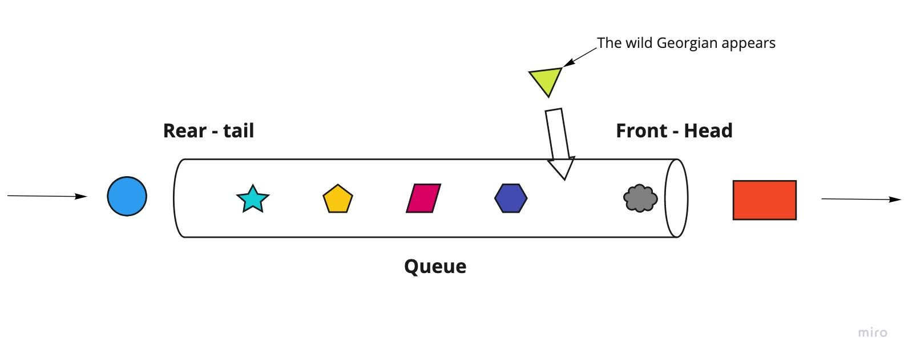

# Georgian Queue



GeorgianQueue is a queue data structure on steroids. The queue you've always wanted to be in.
Implemented using singly linked list and Iterator to traverse.

## Usage
```kotlin
GeorgianQueue<Int>().apply {
    offer(1)
    offer(2)
    offer(3)
    offerLikeGeorgian(99)
}
```
Result: [1, 99, 2, 3]


## License

MIT. See the [LICENSE](/LICENSE) file for details.

## Author

Made by Tato Kutalia. [Follow @TatoKutalia](https://www.twitter.com/tatokutalia) on Twitter for future updates.